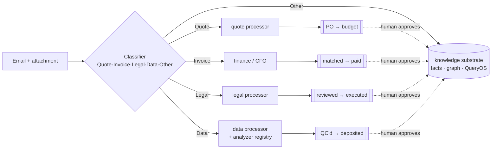
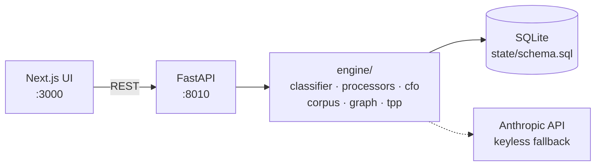

# BiotechOS

**An operating system for running preclinical drug programs.**

> Thesis: **the OS synthesizes, drafts, computes, and tracks; the human decides and signs** — so one scientist can run several programs at once.

BiotechOS reads the real inbox of a drug program — CRO emails, quotes, assay
reports, contracts, invoices — and, for every message, **classifies it, routes it
to a specialized processor, and turns it into a concrete action for a human to
approve.** Those actions flow through four operational loops (procurement, finance,
legal, data). Underneath sits a queryable knowledge base and a TPP scoring engine.
Everything is partitioned by `program_id`, so multi-program is a data property, not
a bolt-on.

Built around two real programs: a **TGTA kinase-inhibitor** program (Program A) and
an **ADC** program (Program B), using anonymized CRO archives (target identity and
chemical structures scrubbed; vendors, people, and values kept real).

---

## What it does

Every inbound email + attachment goes through one pipeline:



1. **Classify** — one LLM classifier (`engine/classifier.py`, the single source of
   truth for the labels) tags every message **Quote · Invoice · Legal · Data ·
   Other**, weighting the most recent message in the thread and the attachment.
2. **Route** — each category has a **processor**: a specialized, schema-bound Claude
   call that extracts exactly what that document type needs.
3. **Queue** — the processor produces a *reviewable action*. Nothing is committed
   silently; a human approves each one.

---

## The four operational loops

| Loop | Trigger | What the processor does → **you approve** → effect |
|------|---------|----------------------------------------------------|
| **Procurement** | Quote email | Format-agnostic extraction of quote lines (with deterministic span-grounding against the source text) → an editable **PO** → **approve** → simulated vendor email → the PO lands on the budget as **outstanding** |
| **Finance** | Invoice email | Auto-**matched to its PO** → **confirm paid** → reconciled against a single **$500K company cash account** |
| **Legal** | Contract / NDA / MSA | Reviewed against house standards with **High / Medium / Low** issues + execution status → **Route for execution** (DocuSign TBD) for fresh/in-revision docs, or **Store Doc** to file a countersigned return |
| **Data** | Assay / CRO result | Detects the data type → runs the matching analyzer → **QC's the vendor's numbers** → charts → **approve** → deposits **molecules + assays into the molecule DB** |

Each loop is a queue in the **Inbox**; approving an item is the only thing that
mutates state.

---

## Processors

A processor is a specialized single LLM call bound to a narrow schema — the opposite
of one giant do-everything prompt. They live in `engine/processors/`:

- **`quote.py`** — extracts quote lines from any vendor's format, then **span-grounds**
  every number: a deterministic check that the extracted amount actually appears in
  the source text (≥80% token overlap), so hallucinated prices are rejected without a
  second model.
- **`data.py` + `analyzers/`** — a **detect → dispatch → analyze** registry. The
  dispatcher classifies the dataset and hands it to the right analyzer
  (`dose_response`, `adme`, `generic`; stubs for kinetics / intact-MS / selectivity /
  PK / thermal-shift). New data types are a new analyzer, not a rewrite.
- **`legal.py`** — reviews a contract against the `draft-legal` house standards
  (Delaware default, mutual NDA, IP assignment, liability caps, …) and returns
  severity-ranked issues + an execution status.

Every processor degrades to a **deterministic keyless fallback**, so the app runs
end-to-end without an API key.

---

## Data QC + native document reading

Two capabilities set the data loop apart:

- **QC against what the vendor claims.** The analyzers don't just transcribe — they
  recompute (4PL curve fits to re-derive IC50, recovery/efflux bands, plausibility
  guards) and flag **discrepancies** between the vendor's reported value and the
  re-derived one. A garbage fit is caught, not deposited.
- **Native document reading, with re-anonymization.** For any incoming data file or
  contract you can choose to send the **real binary** to Claude for native reading
  (PDF/image directly; Office → PDF via LibreOffice) instead of the anonymized text —
  useful for figures, scanned pages, and tables text extraction can't see. Every
  extracted identity is **re-anonymized before it's stored**. Text-only is the safe
  default; native is **opt-in, per file**.

> **Security.** Real CRO PII (`data/corpus/`) and the anonymization maps are
> gitignored and never committed. Native reading is the one path that sends real,
> un-anonymized bytes to the API — it's explicit, per-file, and the extracted fields
> are re-anonymized on the way back in.

---

## Knowledge substrate + QueryOS

Under the queues sits the memory: an immutable log of extracted claims promoted into
a **bitemporal facts** table (so you can ask "what did we believe, and when?"), a
**self-wiring entity graph** of vendors / people / molecules / cell lines / assays /
contracts, and **QueryOS** — grounded Q&A that **verifies every citation** against the
source document (a `[n]` marker only survives if that document actually contains the
value).

```
Q: which vendors can test the CellLine-1 cell line?
A: Vendor 2 [1], Vendor 21 [2], and Vendor 1 [3].

Q: what is Vendor 1's invoice submission email and accepted tax forms?
A: orders@vendor-1.example.com [1]; W-9 (US), W-8BEN (Non-US), VAT Certificate [1][2].
```

Design choices: **temporal ingestion** (emails processed in `sent_at` order, facts
stamped with event time), **fuzzy molecule identity** (one canonical id per compound
across every alias — internal code, CRO project code, InChIKey — tolerant of OCR/typo
drift), and a **data-vs-fluff gate** so LLM spend goes only where there's real data.

*(Deeper internals live in `Architecture.md`.)*

---

## Compound registry

Molecules that arrive through correspondence aren't silently trusted. The **Registry**
surfaces every candidate compound for confirmation, merge (against fuzzy aliases), or
dismissal — with **provenance back to the originating email/attachment**, so you can
see exactly what data and correspondence a molecule's assays came from before it's
registered.

---

## Stack

- **Backend** — Python / FastAPI / SQLite (single committable file, per-program forkable)
- **Frontend** — Next.js 16 / Tailwind v4
- **LLM** — Anthropic SDK (Claude Opus / Sonnet / Haiku), with a keyless deterministic fallback
- **Documents** — native PDF/image reading; Office → PDF via LibreOffice
- **Structure/binding** — Boltz-2 co-folds (behind an interface)



---

## Quickstart

```bash
# Backend (port 8010 — 8000 collides with a local service)
cd backend
uv run uvicorn biotechos.api.main:app --host 0.0.0.0 --port 8010

# Frontend (port 3000; API base auto-derived from the hostname you use)
cd frontend
npm run dev
```

Then open `http://localhost:3000`. Build/refresh the knowledge base for a program:

```bash
# Rebuild corpus + world model (classifies every email, extracts attachment data)
curl -X POST localhost:8010/corpus/ingest -H 'Content-Type: application/json' \
  -d '{"program_id":"demo"}'
```

Key endpoints — the inbox loops: `/mailbox` (5-way category filter) ·
`/quotes` · `/po/create` · `/po/{id}/approve` · `/finance/match-invoices` ·
`/invoices/{id}/confirm-paid` · `/data/analysis/{doc}/run` · `/data/{id}/approve` ·
`/legal/review/{doc}/run` · `/registry/candidates`. The substrate:
`/knowledge/ask` · `/entities` · `/tpp/scores`.

---

## Repo layout

```
backend/biotechos/
  api/main.py            FastAPI routes (program-scoped)
  engine/
    classifier.py        single-source 5-way email classifier
    processors/
      quote.py           quote extractor + span-grounding
      data.py            data-QC dispatcher
      analyzers/         dose_response · adme · generic (+ stubs)
      legal.py           contract review vs house standards
    cfo.py               procurement + finance loop (POs, invoices, cash)
    registry.py          compound registration + provenance
    identity.py          molecule identity / fuzzy alias resolution
    corpus/
      store.py           ingestion -> observations -> facts (bitemporal)
      qa.py              QueryOS: grounded retrielinker-xation verification
    graph.py             entity-name normalization for the knowledge layer
    tpp.py               TPP scoring
  state/schema.sql       program-scoped data model
frontend/src/app/
  mailbox/ quotes/ cfo/ po/ registry/ simulation/
  query/ entities/ tpp/ tpp-builder/ molecules/ ledger/
data/
  corpus/                anonymized CRO archives (real PII gitignored)
  evals/                 regression evals (Q&A, identity, classification)
```

---

## Evals

Fuzzy components are regression-tested against committed cases:

```bash
cd backend && uv run python -m biotechos.evals run          # all suites
uv run python -m biotechos.evals run identity qa            # specific suites
```

Suites: QueryOS Q&A (LLM-judge + groundedness/citation guardrails), email
classification, molecule identity resolution, and decisions.
