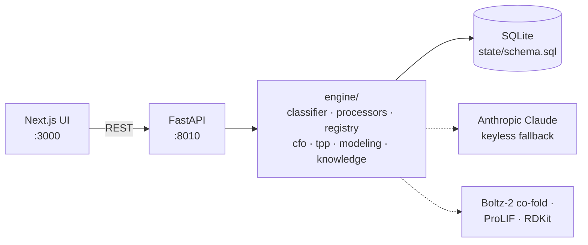

# BiotechOS

> ### ▶ Live demo — [**biotechos-frontend.onrender.com**](https://biotechos-frontend.onrender.com/)
> A fully interactive, fictional **KRAS G12C** program — inbox, registry, molecule database, modeling, and budget. No login, no keys required.
>
*The operating system for a drug-discovery program — inbox to modeling, one human-in-the-loop.*

---

## The Problem

Two forces — AI and outsourcing — have dramatically lowered the cost of doing the science of drug discovery, from discovery through the clinic. But the FTEs a biotech needs to scale haven't fallen because headcount is how you buy judgment and the capacity to coordinate more tasks in parallel. BiotechOS drives these costs toward zero: frontier-AI judgment plus biotech-specific coordination as software, so one person can run a whole pipeline, not a project.

## Our Solution

Using domain-specific coding, BiotechOS turns every inbox message into a concrete action a human just approves, leaving time to focus on science. The OS synthesizes, drafts, computes, and tracks; the human decides and signs. It stores decisions and data, giving the user the ability to quickly find relevant information, determine progress toward their product profile, manage their molecules, even generate new molecule designs to close the AI-assisted design → make → test loop.

## Workflows We Support

- **Data intake** — CRO email → QC extraction → approval → database
- **Procurement** — quote → PO → invoice → reconcile → budget updates
- **Legal review** — contract → Claude legal review → execute + store
- **Compound registration** — new compound → registry gate → folded and active in Molecule Database
- **Define & score** — build a TPP yourself or with Claude → molecules auto-scored pass/fail
- **Structure modeling loop** — co-fold → contact map → generate novel analogs → test the best
- **Ask anything** — QueryOS answers with citations across the whole corpus

## Architecture

A **classifier** sorts every email, then a specialized **processor** turns it into a single action routed to human approval. Approved compounds pass a **registry gate** into the **Molecule Database**, with a full data record and a live pass/fail against the Target Product Profile, plus tools to deep-dive and feed into the modeling loop. Underneath sits the memory: a time-stamped record of every fact, a self-linking graph of vendors, people, molecules, and contracts, and an immutable log of every decision — all partitioned by program.



---

## Explore the demo

The live demo (and a fresh local clone) ships a self-contained, **fictional** program — *Kestrel Therapeutics*, a **KRAS G12C** inhibitor program (`program_id: kras`):

- **50 internal compounds** (`KES-####`) with biochemical, cellular, and selectivity data, scored against a 5-criterion **TPP** — 7 currently meet it.
- **Inbox** with four actionable emails — a **quote**, an **invoice**, a CRO **data** delivery, and a **legal** CDA. DataQC extraction and legal review are fully wired.
- **Budget** of $500K with a quote → PO → paid invoice.
- **Favorites** (`KES-0001…0005`) flagged and grouped, and **co-folded** against the KRAS G-domain (viewable in 3D).
- The data email includes **one new compound** (`KES-0051`) that routes to the **Registry** on approval — showing the new-compound gate end to end.
- A **Reset demo** button (home page) restores the original state at any time.

All demo data is synthetic; the molecules are public reference chemistry.

### Runs with no API keys

LLM features (email classification, DataQC extraction, legal review, QueryOS) use Claude when `ANTHROPIC_API_KEY` is set, and fall back to **precomputed/deterministic** results otherwise. Boltz co-folds run when a Boltz key is present, and are **precomputed** for the demo. So the demo is fully clickable with zero configuration.

---

## Run it locally

```bash
# Backend (port 8010)
cd backend
uv run uvicorn biotechos.api.main:app --host 0.0.0.0 --port 8010

# Frontend (port 3000; API base auto-derived from the hostname you use)
cd frontend
npm run dev
```

Open `http://localhost:3000`. The KRAS demo **auto-seeds on first boot** (or run it explicitly):

```bash
cd backend && uv run python -m biotechos.ingest.seed_kras
```

`uv` installs backend deps from `uv.lock` on first `uv run`; no manual `pip install` needed.

---

## Stack

- **Backend** — Python / FastAPI / SQLite (single, program-scoped data file)
- **Frontend** — Next.js 16 / Tailwind v4
- **LLM** — Anthropic Claude (Opus / Sonnet / Haiku), with a keyless deterministic fallback
- **Structure / binding** — Boltz-2 co-folds, ProLIF interaction fingerprints, RDKit
- **Documents** — native PDF/image reading; Office extraction

## Repo layout

```
backend/biotechos/
  api/main.py              FastAPI routes (program-scoped)
  engine/
    classifier.py          single-source 5-way email classifier
    processors/data.py     DataQC extraction + deposition
    processors/legal.py    contract review vs house standards
    registry.py            compound registration + provenance
    identity.py            molecule identity / fuzzy alias resolution
    cfo.py                 procurement + finance loop (POs, invoices, cash)
    tpp.py                 TPP scoring
    boltz.py               hosted co-fold + small-molecule design client
    prolif_contacts.py     protein-ligand contact maps + LigPlot
  ingest/seed_kras.py      self-contained KRAS demo seeder
  state/schema.sql         program-scoped data model
data/seed/kras/            committed demo data (molecules, emails, folds, TPP, budget)
frontend/src/app/          mailbox · registry · moleculedb · molecules · modeling · cfo · query · ledger
```
