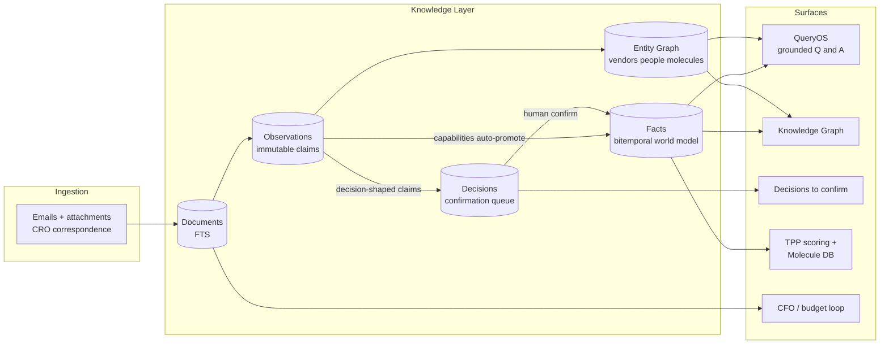
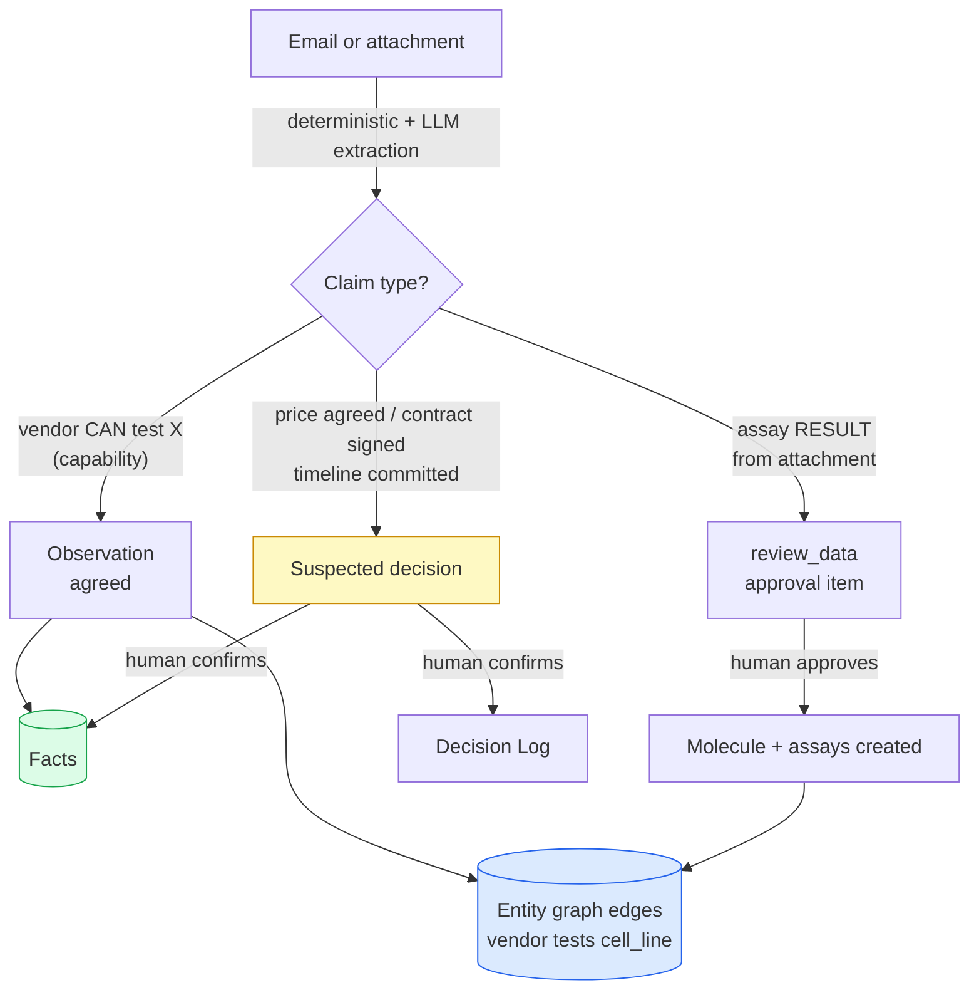
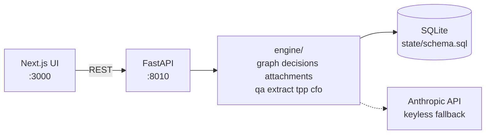

# BiotechOS

**An operating system for running preclinical drug programs.**

> Thesis: **the OS synthesizes, drafts, computes, and tracks; the human decides and signs** — so one scientist can run multiple programs at once.

BiotechOS ingests the real correspondence of a drug program — CRO emails, quotes,
assay reports, contracts, invoices — and turns it into a queryable knowledge base,
a target-product-profile (TPP) scoring engine, and a set of human-in-the-loop
approval loops. Everything is partitioned by `program_id`, so multi-program is a
data property, not a bolt-on.

Built around two real programs: a **TGTA kinase-inhibitor** program (Program A) and
an **ADC** program (Program B), using anonymized CRO archives (target identity and
chemical structures scrubbed; vendors, people, and values kept real).

---

## What it does



- **Ingest** real CRO email archives (bodies **and** attachment text — Excel/PPT/PDF).
- **Extract** structured knowledge: assay results, vendor capabilities, quotes,
  invoices, contract terms, reagent specs — routed to the right store.
- **Confirm** decisions: nothing enters the world model silently; decision-shaped
  claims are surfaced for a human to confirm.
- **Ask** questions in natural language, grounded in facts + documents + molecule
  data, with verified citations.
- **Score** molecules against a versioned TPP and run the procurement/budget loop.

---

## The knowledge layer

The core is a **bitemporal world model**: an immutable log of extracted claims,
promoted into a current-facts table that supersedes over time — so you can ask
"what did we believe, and when?" On top of it sits a **self-wiring entity graph**.



| Store | What it holds | Reachable via |
|-------|---------------|---------------|
| **Documents** | Every email + extracted attachment text (FTS-indexed) | QueryOS retrieval |
| **Observations** | Immutable log of every extracted claim, with provenance | audit / promotion |
| **Facts** | Current believed value per `(subject, predicate)`, bitemporal | QueryOS, Knowledge Graph |
| **Entities + edges** | First-class vendors, people, molecules, cell lines, assays, contracts — typed relationships | Knowledge Graph, QueryOS graph-boost |
| **Decisions** | Suspected decisions awaiting human confirmation | Decisions tab → Facts + Decision Log |

**Design choices**
- **Temporal ingestion** — emails are processed in `sent_at` order and facts/edges are
  stamped with event time, so knowledge accrues chronologically (genuinely bitemporal).
- **Human-gated promotion** — capability facts auto-promote; every commitment
  (price, contract, timeline, go/no-go) waits for confirmation. A keyword heuristic
  never silently decides what the company believes.
- **Attachment intelligence** — a cheap data-vs-fluff classifier gates the LLM:
  invoices/brochures/contracts are recognized and either extracted for their own
  knowledge or skipped, so LLM spend goes only where there's data.
- **Fuzzy molecule identity** — one canonical id per compound across every alias
  (internal code, CRO project code, structure/InChIKey), tolerant of OCR/typo drift
  (`CL0` vs `CLO`, zero-padding, missing dashes).

---

## QueryOS — grounded, cited Q&A

QueryOS answers over three knowledge stores at once and **verifies every citation**
against the source document (a `[n]` marker only survives if that document actually
contains the value), so answers never claim false provenance.

```
Q: what is the SMILES for BTX-1003?
A: The SMILES for BTX-1003 is CNC(=O)c1cc(Oc2ccc(NC(=O)Nc3ccc(Cl)c(C(F)(F)F)c3)cc2)ccn1
   (from the molecule database - no document citation)

Q: which vendors can test the CellLine-1 cell line?
A: Vendor 2 [1], Vendor 21 [2], and Vendor 1 [3].

Q: what is Vendor 1's invoice submission email and accepted tax forms?
A: orders@vendor-1.example.com [1]; W-9 (US), W-8BEN (Non-US), VAT Certificate [1][2].
```

---

## Stack

- **Backend** — Python / FastAPI / SQLite (single committable file, per-program forkable)
- **Frontend** — Next.js 16 / Tailwind v4
- **LLM** — Anthropic SDK (Claude Opus/Sonnet/Haiku), with a keyless deterministic fallback
- **Structure/binding** — Boltz-2 co-folds (behind an interface)



---

## Quickstart

```bash
# Backend (port 8010 - 8000 collides with a local service)
cd backend
uv run uvicorn biotechos.api.main:app --host 0.0.0.0 --port 8010

# Frontend (port 3000; API base auto-derived from the hostname you use)
cd frontend
npm run dev
```

Then open `http://localhost:3000`. Build/refresh the knowledge base for a program:

```bash
# Rebuild corpus + world model (auto-extracts attachment data on ingest)
curl -X POST localhost:8010/corpus/ingest -H 'Content-Type: application/json' \
  -d '{"program_id":"demo"}'
```

Key endpoints: `/knowledge/ask` · `/entities` · `/decisions` · `/mailbox` · `/tpp/scores`.

---

## Repo layout

```
backend/biotechos/
  api/main.py            FastAPI routes
  engine/
    graph.py             entity graph (nodes, typed edges, molecule bridge)
    decisions.py         suspected-decisions confirmation queue
    attachments.py       attachment extraction (assay + general knowledge)
    corpus/
      store.py           ingestion -> observations -> facts (bitemporal, temporal order)
      qa.py              QueryOS: grounded retrielinker-xation verification
    extract/             deterministic + LLM claim extraction
    identity.py          molecule identity / fuzzy alias resolution
    triage.py            inbox triage
    tpp.py, cfo.py       TPP scoring, procurement/budget loop
  state/schema.sql       program-scoped data model
frontend/src/app/
  query/ entities/ decisions/ mailbox/ tpp/ molecules/ cfo/ ledger/
data/
  corpus/                anonymized CRO archives (committed)
  evals/                 regression evals (Q&A, identity, decisions)
```

---

## Evals

Fuzzy components are regression-tested against committed cases:

```bash
cd backend && uv run python -m biotechos.evals run          # all suites
uv run python -m biotechos.evals run identity qa            # specific suites
```

Suites: QueryOS Q&A (LLM-judge + groundedness/citation guardrails), extraction/
classification, molecule identity resolution, and decisions.
